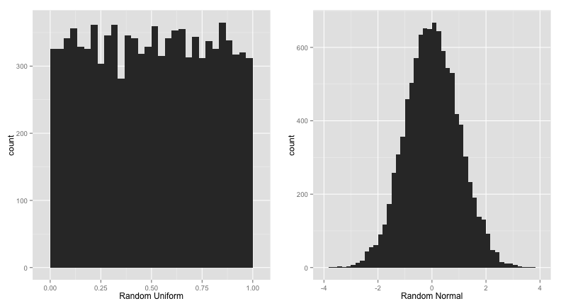

Homework 1
========================================================

## Part 1


We begin by generating an $n$ by $m$ matrix of random normal and random uniform variables.


```r
n = 100
m = 100

matnorm <- c()
matunif <- c()

for (i in c(1:m)) {
    matnorm <- cbind(matnorm, rnorm(n, 0, 1))
    matunif <- cbind(matunif, runif(n, 0, 1))
}
```


We can confirm their distribution by plotting the generated variables:


```r
p1 <- qplot(as.vector(matunif), binwidth = 1/30, xlab = "Random Uniform")
p2 <- qplot(as.vector(matnorm), binwidth = 5/30, xlab = "Random Normal")
grid.arrange(p1, p2, ncol = 2)
```

 


Using the `cor` function we can get the correlations between the generated variables as follows:


```r
corrnorm <- cor(matnorm)
corrunif <- cor(matunif)
correlations <- data.frame(corr = c(corrnorm[lower.tri(corrnorm)], corrunif[lower.tri(corrunif)]), 
    dist = c(rep("Normal", times = length(corrnorm[lower.tri(corrnorm)])), rep("Uniform", 
        times = length(corrunif[lower.tri(corrunif)]))))
```


Interestingly, plotting the correlation coefficients between the respective variables shows no systematic difference between the normal and uniform variables.


```r
p1 <- qplot(x = corr, data = correlations, fill = dist, geom = "density", alpha = I(0.5))
p2 <- ggplot(correlations, aes(x = corr, fill = dist)) + geom_histogram(data = correlations, 
    alpha = 0.5, position = "identity", binwidth = 1/60)
grid.arrange(p1, p2, ncol = 2)
```

 


While the majority of the correlations are fairly small, the table below shows there are multiple weakly correlated variables that occurred by chance. This demonstrates the risks of relying on correlation matrices in data sets with a large number of explanatory variables.

|cor>0.3     |  Normal|  Uniform|
|:------|-------:|--------:|
|FALSE  |    4938|     4941|
|TRUE   |      12|        9|

---

## Part 2

The function below repeatedly adds random columns, $x_1...x_k \sim \mathcal{N}(0,1)$ and fits a regression on $y \sim \mathcal{N}(0,1)$ until $r^2 > 0.95$. The breakout parameter prevents an infinite loop (though, as explained below, it is unnecessary because the loop is guaranteed to converge to $r^2 = 1$).


```r
testr2 <- function(threshold = 0.95, breakout = 200) {
    nvars <- 0
    data <- data.frame(y = rnorm(100, 0, 1))
    for (i in c(1:breakout)) {
        data <- cbind(data, rnorm(100, 0, 1))
        names(data) <- c("y", paste("x", c(1:i), sep = ""))
        r2 <- summary(lm(y ~ ., data))$r.squared
        if (r2 > threshold) {
            nvars <- i
            break
        }
    }
    return(i)
}
```


In order to get an indication of the distribution of the $k$, the number of $x_i$ variables required for $r^2>0.95$
, we run the ```testr2``` function 200 times and summarize the results.


```r
k <- sapply(rep(0.95, 200), testr2)
```


```r
qplot(k, binwidth = 0.5, main = "Histogram of k")
```

 


```r
summary(k)
```

```
##    Min. 1st Qu.  Median    Mean 3rd Qu.    Max. 
##    83.0    92.0    94.0    93.4    95.2    99.0
```

```r
shapiro.test(k)
```

```
## 
## 	Shapiro-Wilk normality test
## 
## data:  k
## W = 0.9555, p-value = 6.682e-06
```


From the histogram of the values of $k$, two observations can be made: the values are distributed around the mean of 93.4 in a somewhat normal fashion (though the Shapiro-Wilk test strongly rejects the normality null - most likely as a result of the fat tails in the distribution), and the distribution of $k$ appears censored at 99. The latter result occurs because with 99 explanatory variables we have 100 parameters (including the intercept) and 100 data points and thus we run out of degrees of freedom and perfectly fit the data, so our $r^2$ trivially goes to 1.
